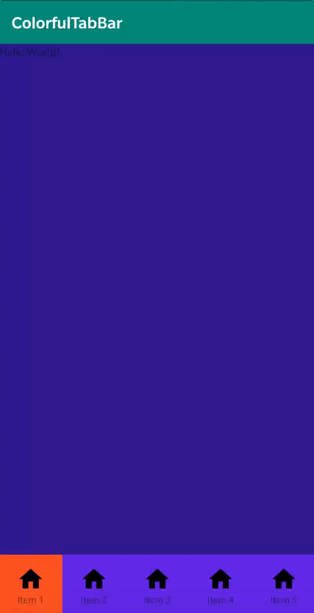

# ColorNavigationBar

彩色的TabBar，加平滑的切换动画，并自带Q弹效果

模仿iOS开源库：https://github.com/saitjr/STColorfulTabBar

## Add dependency
### **Step 1.** Add the JitPack repository to your build file
### Add it in your root build.gradle at the end of repositories:   

```gradle
allprojects {
  repositories {
    ...
    maven { url 'https://jitpack.io' }
  }
}
```

### **Step 2.** Add the dependency
```gradle
dependencies {
  compile 'com.github.csming1995:ColorNavigationBar:1.0-beta2'
}
```

### **Step 3.** Usage

**Layout:**

```xml
<?xml version="1.0" encoding="utf-8"?>
<FrameLayout xmlns:android="http://schemas.android.com/apk/res/android"
    xmlns:app="http://schemas.android.com/apk/res-auto"
    xmlns:tools="http://schemas.android.com/tools"
    android:layout_width="match_parent"
    android:layout_height="match_parent"
    tools:context=".MainActivity"
    android:background="#311B92">

    <com.csming.colorfulnavigation.ColorfulNavigation
        android:id="@+id/colorful_navigation"
        android:layout_width="match_parent"
        android:layout_height="80dp"
        android:layout_gravity="bottom"
        android:background="#6200EA"/>

</FrameLayout>
```

**Activity:**

```java
public class MainActivity extends AppCompatActivity {

    private ColorfulNavigation mColorfulNavigation;

    private static final int ID_1 = 1;
    private static final int ID_2 = 2;
    private static final int ID_3 = 3;
    private static final int ID_4 = 4;
    private static final int ID_5 = 5;

    @Override
    protected void onCreate(Bundle savedInstanceState) {
        super.onCreate(savedInstanceState);
        setContentView(R.layout.activity_main);

        mColorfulNavigation = findViewById(R.id.colorful_navigation);
        mColorfulNavigation.add(new ColorfulNavigation.Item(ID_1, R.drawable.ic_home_black_24dp, R.color.test1, "Item 1"));
        mColorfulNavigation.add(new ColorfulNavigation.Item(ID_2, R.drawable.ic_home_black_24dp, R.color.test2, "Item 2"));
        mColorfulNavigation.add(new ColorfulNavigation.Item(ID_3, R.drawable.ic_home_black_24dp, R.color.test3, "Item 3"));
        mColorfulNavigation.add(new ColorfulNavigation.Item(ID_4, R.drawable.ic_home_black_24dp, R.color.test4, "Item 4"));
        mColorfulNavigation.add(new ColorfulNavigation.Item(ID_5, R.drawable.ic_home_black_24dp, R.color.test5, "Item 5"));

        mColorfulNavigation.setOnItemSelectedListener(new ColorfulNavigation.OnItemSelectedListener() {
            @Override
            public void onItemSelected(ColorfulNavigation.Item item) {
//                Toast.makeText(MainActivity.this, "" + item.getId(), Toast.LENGTH_SHORT).show();
                switch(item.getId()) {
                    case ID_1 :{
                        break;
                    }
                    case ID_2: {
                        break;
                    }
                    case ID_3 :{
                        break;
                    }
                    case ID_4: {
                        break;
                    }
                    case ID_5: {
                        break;
                    }
                    default:{
                        break;
                    }
                }
            }
        });
    }
}
```

## 效果展示


